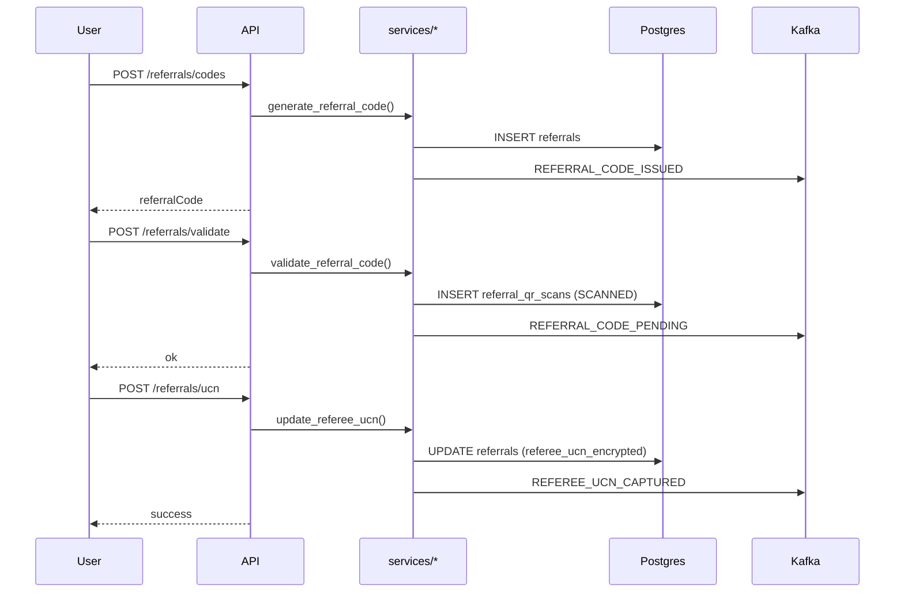
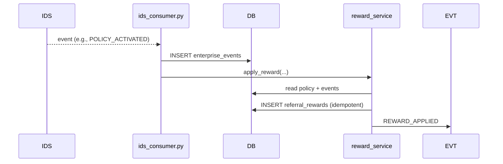
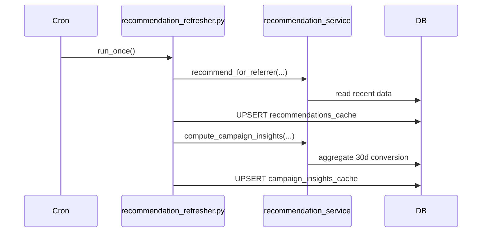

# Sequence Flows (Mermaid)

## Referral → Validation → UCN

```mermaid
sequenceDiagram
    participant User
    participant API
    participant SVC as services/*
    participant DB as Postgres
    participant EVT as Kafka

    User->>API: POST /referrals/codes
    API->>SVC: generate_referral_code()
    SVC->>DB: INSERT referrals
    SVC->>EVT: REFERRAL_CODE_ISSUED
    API-->>User: referralCode

    User->>API: POST /referrals/validate
    API->>SVC: validate_referral_code()
    SVC->>DB: INSERT referral_qr_scans (SCANNED)
    SVC->>EVT: REFERRAL_CODE_PENDING
    API-->>User: ok

    User->>API: POST /referrals/ucn
    API->>SVC: update_referee_ucn()
    SVC->>DB: UPDATE referrals (referee_ucn_encrypted)
    SVC->>EVT: REFEREE_UCN_CAPTURED
    API-->>User: success
```

## IDS Event → Reward

```mermaid
sequenceDiagram
    participant IDS
    participant Worker as ids_consumer.py
    participant DB
    participant SVC as reward_service
    participant EVT

    IDS-->>Worker: event (e.g., POLICY_ACTIVATED)
    Worker->>DB: INSERT enterprise_events
    Worker->>SVC: apply_reward(...)
    SVC->>DB: read policy + events
    SVC->>DB: INSERT referral_rewards (idempotent)
    SVC->>EVT: REWARD_APPLIED
```

## Nightly Recommendations

```mermaid
sequenceDiagram
    participant Cron
    participant Worker as recommendation_refresher.py
    participant SVC as recommendation_service
    participant DB

    Cron->>Worker: run_once()
    Worker->>SVC: recommend_for_referrer(...)
    SVC->>DB: read recent data
    Worker->>DB: UPSERT recommendations_cache

    Worker->>SVC: compute_campaign_insights(...)
    SVC->>DB: aggregate 30d conversion
    Worker->>DB: UPSERT campaign_insights_cache
```
